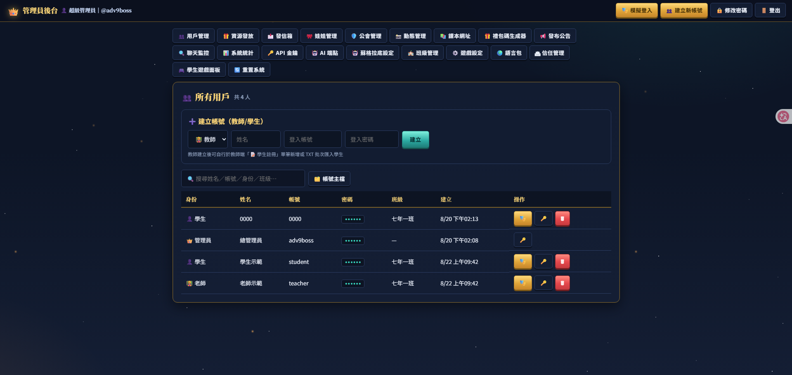
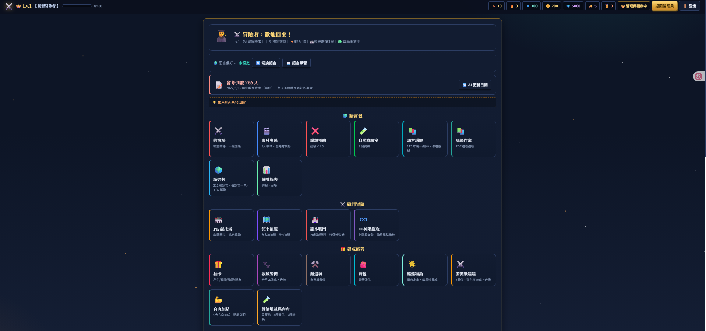
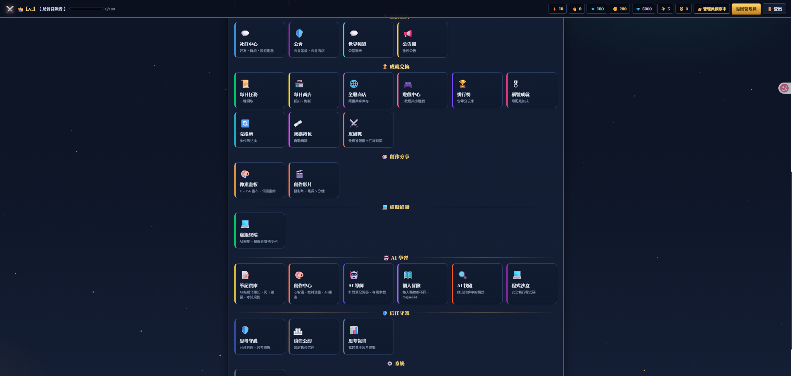
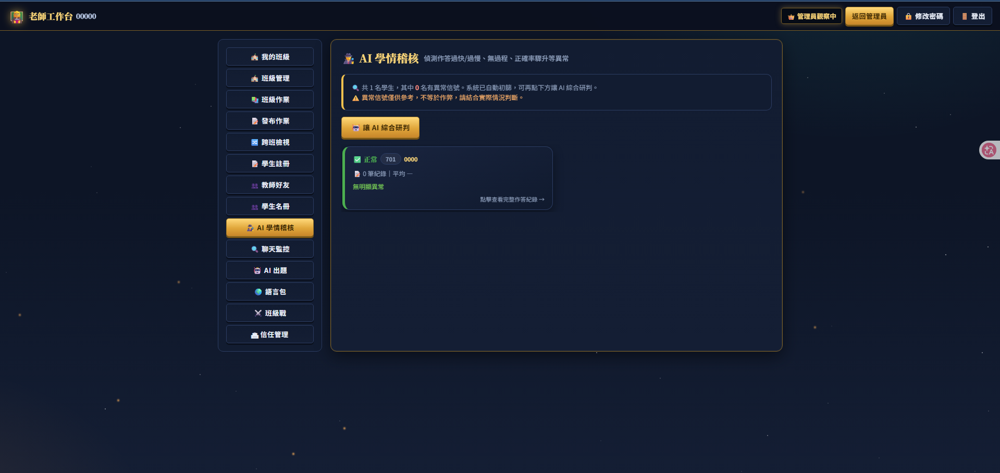

# 🎮 Adventurer Learning Platform / 冒險者學習平台

A gamified learning platform: quiz adventures, card-based character development, guild battles, homework assignment, AI assistants, and social interaction. **Single Node.js server + Argon2 password hashing.**

把課業變成冒險遊戲的學習平台：答題冒險、抽卡養成、公會對戰、作業發布、AI 助理、社群互動。**單一 Node.js 伺服器、Argon2 密碼雜湊**。

- **Password security / 密碼安全**: Argon2id hashing (falls back to scrypt if `argon2` is unavailable)
- **Docker one-click deploy / Docker 一鍵部署**: Any Linux / macOS / Windows
- **All data stays local / 資料皆留在本機**: Accounts, settings, AI keys in `data/`, `media/`
- **Default admin / 預設管理員**: `adv9boss` / `admin123` (**change password on first login** / 首次登入請改密碼)

---

## 📸 Screenshots / 畫面截圖

### 管理員後台 / Admin Panel


### 學生主頁 / Student Home


### 學生功能總覽 / Student Features


### 老師工作台 / Teacher Dashboard


---

## ✨ Features / 功能特色

| Feature | Description / 說明 |
|---------|-------------|
| 🎯 Quiz Adventure / 問答冒險 | Answer questions to progress through dungeons, earn XP and loot |
| 🃏 Card Collection / 卡牌收藏 | Character, pet, and anime card gacha system |
| ⚔️ Guild Wars / 公會戰 | Team battles, territory control, class competitions |
| 📝 Homework / 作業 | Teachers assign work, AI-powered weak point analysis |
| 🤖 AI Assistant / AI 助手 | Multi-provider (Gemini/OpenAI/DeepSeek/Qwen/Kimi/Ollama) |
| 🌍 Language Learning / 語言學習 | 211 languages with AI-generated vocabulary quizzes |
| 💻 Code Sandbox / 程式沙盒 | Python, C++, Java, CaoMang, BingZhengZheng execution |
| ⚙️ C++ Black Box / C++ 黑盒 | Cultivation battle simulation & loot generation computed by a compiled C++ black box |
| 🎨 Pixel Art / 像素畫 | Collaborative pixel art gallery |
| 🎵 Background Music / 背景音樂 | Admin-managed MP3/YouTube music player |
| 💬 Chat & Social / 聊天與社交 | Friends, groups, mail, story posting |
| 📊 AI 學情稽核 / AI Audit | Teacher dashboard with AI-powered student behavior analysis |
| 🗡️ Rogue-like / 個人冒險 | Each player's adventure path is unique |
| 📝 Notes & Flashcards / 筆記寶庫 | Note-taking, flashcards, spaced repetition, exam planning |
| 🧪 Forge & Equipment / 鍛造裝備 | Crafting system with quality tiers and material gathering |
| 🏰 Territory / 領土征服 | Cross-subject conquest battles with reward multipliers |
| 🗣️ AI 導師 / AI Tutor | Personalized tutoring based on your notes and progress |

---

## 🤖 AI Reviews / AI 綜合評價

Multiple AI models (DeepSeek, Qwen, Claude) independently evaluated this platform against PaGamO, Cool English (酷英網), and 均一教育平台. Below is an integrated summary.
多家 AI 模型（DeepSeek、Qwen、Claude）分別將本平台與 PaGamO、酷英網、均一教育平台進行了獨立評估。以下為整合摘要。

### Comparison with Traditional Platforms / 與傳統平台比較

| Dimension / 維度 | Adventurer | PaGamO | 均一 | Cool English |
|-----------------|-----------|--------|------|-------------|
| Gamification / 遊戲化強度 | ★★★★★ | ★★★★ | ★★ | ★★★ |
| AI Integration / AI 整合度 | ★★★★★ 多模型 | ★ | ★ | ★★★★ 語音強 |
| Customizability / 客製化 | ★★★★★ 開源 | ★ 封閉 | ★ 封閉 | ★ 封閉 |
| Data Ownership / 資料主權 | ★★★★★ 自管 | ★★★ 代管 | ★★★ 代管 | ★★★★ 政府 |
| Social Features / 社群互動 | ★★★★★ | ★★★★ | ★ | ★ |
| Code Learning / 程式學習 | ★★★★★ 沙盒 | ✗ | ★★★ | ✗ |

### Key Strengths Identified by AI / AI 識別的核心優勢

1. **Open-source & self-hosted / 開源自架** — Unlike all three SaaS competitors, you own your data and can modify anything.
   不同於三個 SaaS 競品，你完全擁有資料並可修改任何功能。

2. **Deepest gamification / 最深度遊戲化** — Card gacha + guild wars + territory conquest + forge crafting goes far beyond PaGamO's territory mechanic.
   抽卡 + 公會戰 + 領土征服 + 鍛造系統，遠超 PaGamO 的領土機制。

3. **Multi-model AI / 多模型 AI** — Supports 6+ providers (Gemini/OpenAI/DeepSeek/Qwen/Kimi/Ollama) with local Ollama option for privacy.
   支援 6+ 供應商，支援 Ollama 本機部署保障隱私。

4. **Built-in code sandbox / 內建程式沙盒** — Only platform combining gamified learning with Python/C++/Java execution.
   唯一結合遊戲化學習與 Python/C++/Java 執行環境的平台。

5. **211 languages / 211 種語言** — Language coverage far exceeds Cool English (English-only) and 均一 (mainly Chinese/English/Math).
   語言覆蓋範圍遠超酷英（僅英語）與均一（主要中英數理）。

### Best Use Cases / 最適合的使用場景

| Who / 對象 | Recommended / 推薦 | Why / 原因 |
|-----------|-------------------|-----------|
| Tech-savvy teachers & developers / 技術型教師與開發者 | **Adventurer** ⭐⭐⭐⭐⭐ | Full control, maximum customization, AI + code sandbox |
| Innovation schools & CS educators / 創新學校與資訊科教師 | **Adventurer** ⭐⭐⭐⭐⭐ | Privacy-first AI, code sandbox for maker courses |
| Self-learners & gamers / 自學者與遊戲愛好者 | **Adventurer** ⭐⭐⭐⭐ | Offline demo, deepest gamification, open-source learning |
| General K-12 teachers / 一般中小學教師 | **均一 + PaGamO** ⭐⭐⭐⭐⭐ | Zero setup, curriculum-aligned, stable long-term |
| English-focused students / 英語專攻學生 | **Cool English** ⭐⭐⭐⭐⭐ | Best AI pronunciation, official government content |
| Classroom motivation / 班級動機提升 | **PaGamO** ⭐⭐⭐⭐ | Territory battles drive team-based motivation |

---

## 🚀 Deployment / 部署方法

### Option 1: GitHub Codespaces (Free / 免費)

前往儲存庫 → **Code → Codespaces → Create codespace on main**，然後貼上:

```bash
[ -f adv9_public.tgz ] || curl -sL https://raw.githubusercontent.com/loyuan1114/Adventurer-Learning-Platform/main/adv9_public.tgz -o adv9_public.tgz; mkdir -p adv9 && tar xzf adv9_public.tgz -C adv9 && cd adv9 && docker compose up -d --build
```

Then: **Ports** panel → 8080 → Right-click → **Port Visibility → Public** → Open 🌐

### Option 2: VPS (Ubuntu/Debian)

```bash
command -v docker >/dev/null 2>&1 || curl -fsSL https://get.docker.com | sh; docker compose version >/dev/null 2>&1 || sudo apt-get install -y docker-compose-plugin; [ -f adv9_public.tgz ] || curl -sL https://raw.githubusercontent.com/loyuan1114/Adventurer-Learning-Platform/main/adv9_public.tgz -o adv9_public.tgz; mkdir -p adv9 && tar xzf adv9_public.tgz -C adv9 && cd adv9 && docker compose up -d --build
```

Open `http://your-ip:8080` (allow port 8080 in firewall/security group).

### Option 3: Direct Node.js (No Docker)

```bash
git clone https://github.com/loyuan1114/Adventurer-Learning-Platform.git
cd Adventurer-Learning-Platform
npm install          # installs argon2 (optional: falls back to scrypt)
g++ -O2 -std=c++17 calc_blackbox.cpp -o calc_blackbox   # compile C++ black box (simulation/loot)
node server.js
```

Requires **Node.js 18+** (Node 20+ recommended for Argon2) and **g++** (for the C++ black box). Python 3 optional (for document import).

### Option 4: macOS / Windows

- **macOS**: `brew install --cask docker` → Docker Desktop → run Option 1 command
- **Windows**: `winget install Docker.DockerDesktop` → Docker Desktop → run Option 1 command

---

## 🌐 GitHub Pages (Static Full-Game Demo)

GitHub Pages serves the **entire `public/` folder** as a fully static site. Because the frontend stores everything in `localStorage`, the **complete game runs offline in single-admin mode** without any backend.

**Live demo**: `https://loyuan1114.github.io/Adventurer-Learning-Platform/`

**GitHub Pages account**:

| Role | Username | Password |
|------|----------|----------|
| 管理員 / Master admin | `adv9boss` | `admin123` |

> ⚠️ 請在第一次登入後立即變更密碼（帳號頁）。Pages 版資料只存於該瀏覽器的 `localStorage`，清除瀏覽器資料會清空進度。

How it works:

1. The `index.html` on GitHub Pages auto-detects `github.io` and runs in **offline single-admin mode** (`SUPA_ON = false`).
2. All data is stored in the browser's `localStorage`.
3. Optionally, you can set an **API server address** (設定 → API 伺服器位址) to connect to your VPS for shared data.
4. Deployment is automatic via GitHub Actions (`deploy-pages`) on every push to `main`.

Deploy to your own Pages:

1. Fork this repository
2. Keep the built-in GitHub Actions workflow (`.github/workflows/pages.yml`) — it deploys on every push to `main`
3. Your demo is live at `https://your-username.github.io/Adventurer-Learning-Platform/`

> ⚠️ GitHub Pages only serves static files. Multi-user shared data requires a VPS backend.

---

## 🛠️ Admin Settings / 管理員設定

| Setting | Description |
|---------|-------------|
| Default account | `adv9boss` / `admin123` |
| Password hashing | Argon2id (or scrypt fallback) |
| Change password | Login → Account page |
| AI keys | Login → Admin → **API 金鑰管理** |
| AI Provider | Login → Admin → **AI 端點** (Gemini/OpenAI/DeepSeek/Qwen/Kimi/Ollama) |
| Music upload | Login → Settings → **背景音樂** → Admin upload block |
| Socratic prompts | Login → Admin → **蘇格拉底設定** |

---

## 🤖 Local AI (Ollama, Free / 免費本機 AI)

Run AI entirely on your server with no API keys:

```bash
curl -fsSL https://ollama.com/install.sh | sh && ollama pull huihui_ai/qwen2.5-vl-abliterated:7b
```

Then: Admin → **AI 端點** → Add → Provider: Ollama → Model: `qwen2.5-vl-abliterated:7b` → Key: `http://127.0.0.1:11434`

---

## 📁 Data & Backup / 資料與備份

```
data/    Accounts, settings, AI keys, homework, chat logs (JSON files)
media/   Uploaded photos, videos, music
```

- **Upgrade without losing data**: `docker compose down` then `up -d --build`
- **Full backup**: `tar czf backup.tgz data media`
- **Restore**: Extract backup → `docker compose restart`

---

## 🗑️ Uninstall / 刪除與卸載

- **Stop (keep data)**: `cd adv9 && docker compose down`
- **Delete everything**: `docker compose down; cd ..; rm -rf adv9 adv9_public.tgz`
- **Backup first**: `tar czf backup.tgz data media` before deleting

---

## 📜 License / 開源授權

**AGPL-3.0-or-later** (see `LICENSE`). If you modify and run this software as a network service, you must provide the source code to users.

---

## 🔍 AI / Tool Call Disclosure / AI 呼叫揭露

| Function | Provider | Data Flow |
|----------|----------|-----------|
| 🤖 Auto Quiz | Your configured provider | Question request → Provider → Quiz returned |
| 📊 Weak Analysis | Same (default: Ollama local) | Error stats → Provider → Teaching suggestions |
| 💬 AI Comments | Same | Student name, grades → Provider |
| 🔤 Fonts | Google Fonts | Browser loads font files |
| 🖼 Thumbnails | Bing | Search thumbnails loaded |

> See [`THIRD_PARTY_NOTICES.md`](THIRD_PARTY_NOTICES.md) for full list. **Only Ollama local mode** keeps data entirely on your server.

---

## 📸 Photo Policy (CC0 / 圖片授權)

All photos are **CC0 Public Domain**. Uploading photos implies consent to CC0 licensing. Use CC0 sources (Pixabay/Unsplash/Wikimedia Commons) for built-in backgrounds.

---

## ❓ FAQ / 常見問題

- **Port 8080 not accessible?** Allow port 8080 in your firewall/security group.
- **How to update?** Download latest release, extract over old (keep `data/` and `media/`), run `docker compose up -d --build`.
- **No Docker?** Run `node server.js` directly (Node.js 18+ required, `npm install` first for Argon2).
